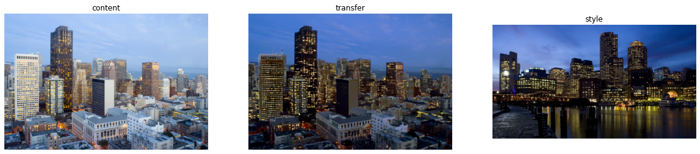
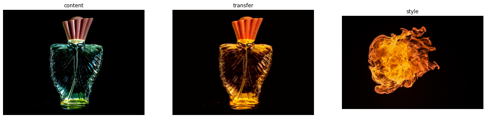
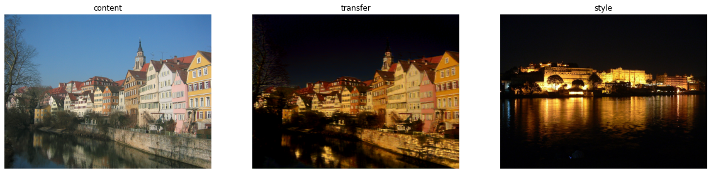

# Video Style Transfer


Content             |  Style | Transfer
:-------------------------:|:-------------------------:|:---:
  |   | 
 
Video Style Transfer is a CSCI 590 Directed Research project supervised by Prof. [Scott Easley](https://viterbi.usc.edu/directory/faculty/Easley/Scott). This project aims to build a pipeline with new cost-effective and professional-looking cinematic imagery that transfers styles of the given image into a video.

### Motivation

Professional cinematic lighting costs thousands of dollars, as does color correction after a film is developed. This research is a way to see if a lot of that can be circumvented by simply choosing an existing image as an input and having the algorithm do all the relighting.

[Neural Style Transfer](https://openaccess.thecvf.com/content_cvpr_2016/papers/Gatys_Image_Style_Transfer_CVPR_2016_paper.pdf), regardless of how fancy it is, depreciates the image into a garbled series of lines and colors. So while it is initially interesting, it has very limited applications in a film. [Photo Style Transfer](https://openaccess.thecvf.com/content_cvpr_2017/papers/Luan_Deep_Photo_Style_CVPR_2017_paper.pdf) can be used to color-correct images that are shot well but are not lit well or have uncorrected color. However, due to computing Matting Laplacian matrices for retaining the photorealistic semantic, Photo Style Transfer runs painfully slow and is not able to process a video with hundreds and thousands of image frames. 

### Method

This project employs the [HR-Net](https://ieeexplore.ieee.org/abstract/document/9052469?casa_token=y1aLdMGcewkAAAAA:UH78gcYDmeq6umHIbLCK9-py4U4cFYzRAgWOG9ltR7ozb4X7_q-5DPMM9wRXJCWhE3VoxjyqVw) architecture to preserve semantic information and employs a similar approach to Neural Style Transfer to extract image styles. The style transfer is achieved by minimizing the Mean Squared Error between the content and style activation maps. However, unlike traditional Neural Style Transfer methods, which are model-free and require a computationally intensive process to transfer style for each new task, training the HR-Net model allows for the learning of both semantic and style patterns. As a result, the inference time is significantly reduced, as fine-tuning the content-style trade-off only needs to be performed once for a specific pair of content and style images. The HR-Net model can then be applied to all subsequent frames with similar semantic information, greatly reducing computational time compared to model-free methods.

## How to use

1. use ffmpeg command to split the [video](./videos/video.mp4) into [frames](/frames/).

```sh
ffmpeg -i video.mp4 ./frames/%d.jpg
```
2. open the interactive Jupyter notebook, [video_transfer.ipynb](/video_transfer.ipynb), to fine-tune the content-style trade-off on the first frame and apply the satisfied transfer effect to other frames.

**Note:** You can also use this notebook to address photorealistic transfer tasks. Some examples are shown below.






3. use ffmpeg command to integrate frames into the video.
```sh
ffmpeg -f image2 -i ./results/%d.jpg -b:v 5842k output.mp4
``` 

## Demo in the [code](/video_transfer.ipynb)
Content             |  Style | Transfer
:-------------------------:|:-------------------------:|:---:
  |   | 


## Areas of Improvement

1. High-Resolution frames
2. Quality reduction avoidance
3. Long videos with inconsistent background
4. Fine-tune automation

### Contact
If you are interested in this project or have questions about it, feel free to contact Rong Liu (<rliu8691@usc.edu>), Venkatesh Vayachal (<vayachal@usc.edu>), and Scott Easley (<seasley@usc.edu>).